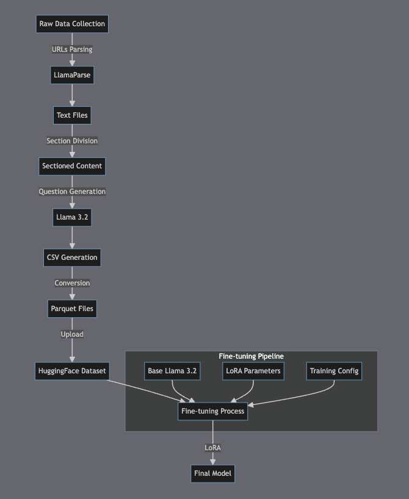

# SJSU Academic Advisor Model Fine-tuning

## Project Overview
This repository contains the fine-tuning implementation of Llama 3.2 model (llama_32_1b_advisor) specialized for SJSU academic advising. The model is designed to provide accurate guidance about SJSU's academic programs, particularly focusing on Computer Engineering department offerings.

## Architecture Overview



## Model Architecture

### Base Model
- **Model**: Llama 3.2 1B
- **Architecture Type**: Decoder-only Transformer
- **Specialization**: Academic advising for SJSU programs

### Fine-tuning Parameters
- **Rank (r)**: 16 (chosen from recommended values: 8, 16, 32, 64, 128)
- **LoRA Alpha**: 16
- **Target Modules**:
  - q_proj (Query projection)
  - k_proj (Key projection)
  - v_proj (Value projection)
  - o_proj (Output projection)
  - gate_proj (Gate projection)
  - up_proj (Upsampling projection)
  - down_proj (Downsampling projection)

### Training Configuration
- **Batch Size**: 2 (per device)
- **Gradient Accumulation Steps**: 4
- **Effective Batch Size**: 8 (2 * 4)
- **Training Epochs**: 10
- **Learning Rate**: 2e-4
- **Optimizer**: AdamW (8-bit)
- **Weight Decay**: 0.01
- **Learning Rate Schedule**: Linear
- **Warmup Steps**: 5
- **Random Seed**: 3407

### Hardware Optimizations
- **Memory Efficiency**: Using "unsloth" gradient checkpointing (30% less VRAM)
- **Precision**: Mixed precision training (bfloat16 where supported)
- **LoRA Dropout**: 0 (optimized setting)
- **Bias Configuration**: "none" (optimized setting)

## Data Processing Pipeline

### 1. Data Collection
- Source: SJSU official website URLs
- Total URLs processed: 14
- Primary focus: Computer Engineering department programs

### 2. Content Extraction
```bash
# URL processing example
python llama_parse.py --input urls.txt --output parsed_content/
```

### 3. Data Preprocessing Steps
1. **Content Parsing**
   - Used LlamaParse for HTML content extraction
   - Generated separate text files for each URL
   
2. **Section Division**
   - Split content into logical sections
   - Maintained hierarchical structure
   
3. **Question Generation**
   - Utilized Llama 3.2 for automatic question generation
   - Generated Q&A pairs for each section
   
4. **Data Format Conversion**
   ```python
   # Format conversion pipeline
   raw_text → CSV → Parquet
   ```

### 4. Dataset Creation
- Final format: Parquet files
- Hosted on: HuggingFace Hub
- Dataset structure:
  ```
  - text: string (contains instruction and response pairs)
  - metadata:
    - source_url: string
    - section: string
    - timestamp: datetime
  ```

## Training Process

### Setup Instructions
```bash
# Clone repository
git clone [repository-url]
cd llama_32_1b_advisor

# Install dependencies
pip install -r requirements.txt

# Start training
python train.py --config config/training_config.yaml
```

### Monitoring and Evaluation
- Training progress logged every step
- Key metrics:
  - Loss
  - Learning rate
  - Gradient norm
  - Memory usage

## Model Usage

```python
from transformers import AutoTokenizer, AutoModelForCausalLM

# Load model and tokenizer
model_name = "llama_32_1b_advisor"
tokenizer = AutoTokenizer.from_pretrained(model_name)
model = AutoModelForCausalLM.from_pretrained(model_name)

# Generate response
def generate_response(prompt, max_length=512):
    inputs = tokenizer(prompt, return_tensors="pt")
    outputs = model.generate(**inputs, max_length=max_length)
    return tokenizer.decode(outputs[0], skip_special_tokens=True)
```

